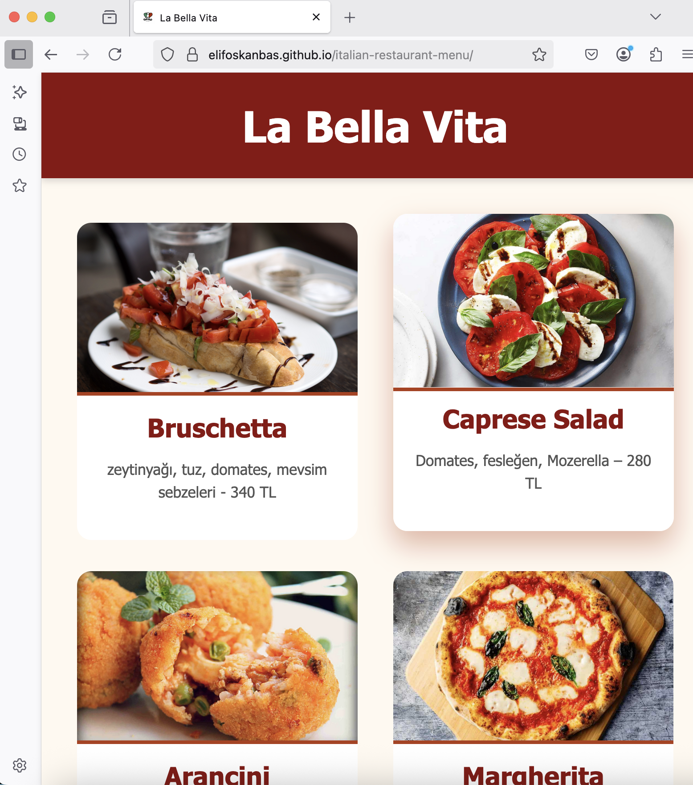
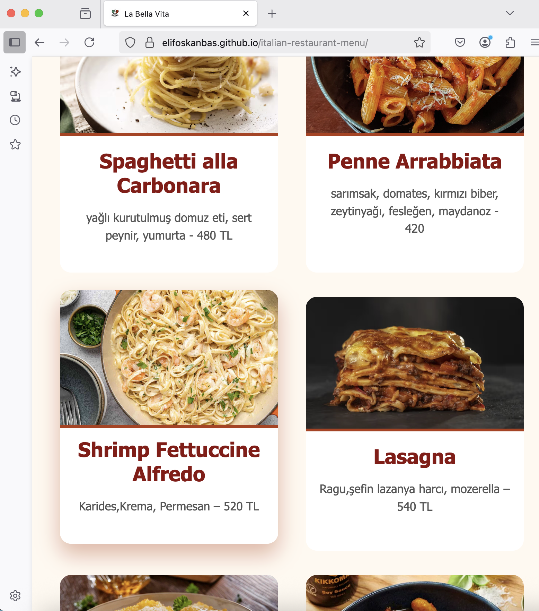

# La Bella Vita - Italian Restaurant Website

This project is a simple and elegant Italian restaurant website design created using HTML and CSS. It is one of my first projects in web development, prepared to improve my basic front-end skills.

## About the Project

- **Title:** La Bella Vita  
- **Technologies:** HTML5, CSS3  
- **Features:**  
  - Listing of various Italian cuisine dishes on the menu  
  - Each menu item includes an image, name, and description  
  - Basic layout adjustments for responsive design  
  - Site icon (favicon) included

## Project Structure

- `index.html` : Main HTML page  
- `lib/style.css` : Stylesheet  
- Images are used via URLs from the web; you can replace them with local files if you wish.

## How to Use

1. Clone this project or download it as a ZIP file.  
2. Open the `index.html` file in a modern web browser.  
3. You can find and modify the CSS file at `lib/style.css` as you like.  

---

## Project Preview

Thank you! I welcome any feedback and suggestions.  
